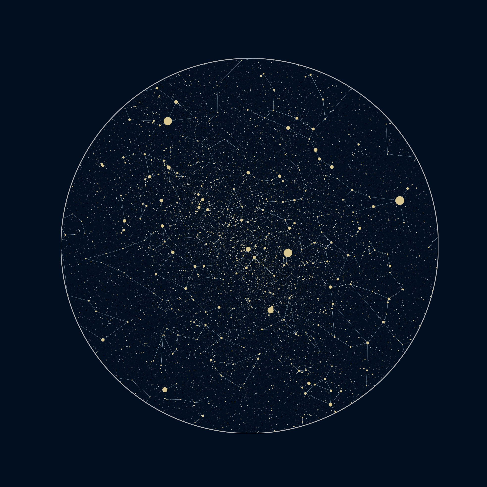

# Stars chart

A notebook to create a star chart at a specific time and location:

20 August 2023, 00:00.  
Latitude & longitude - 47.639483, 11.348130

I created the four figure elements separately (small stars, big stars, horizon line and constellation lines) using matplotlib and combined them in GIMP. 

## Create a conda environment and install packages
  
`conda create -n stars-chart -c conda-forge --file requirements.txt`

## Processing in GIMP

- open the four images in separate layers
- create a background layer
- apply Gaussian blur to big stars and put the blurred image under the oroginal to create a halo effect
- similarly, apply radial blur to the small stars and overlay with the original
- same for the constellation lines
- combine all layers and rotate the image  

